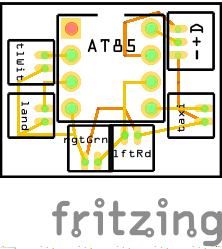
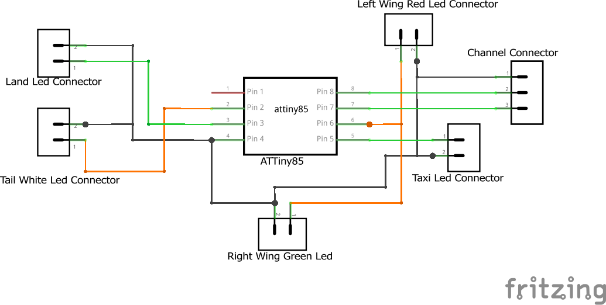

# Cessna 182 Lights

  

Cessna 182 RC plane lights control.  
### This project made with and for ATtiny85 platform.

## Contents
 - [How it works](#how-it-works)
 - [Quick start](#quick-start)
    - [Installing](#installing)
    - [Using](#using)
 - [Breadboard](#breadboard)
 - [Schematic](#schematic)
 - [Related Projects](#related-projects)
 - [License](#license)
 
 ## How It Works
 - When the arduino reads pulse change from the tx pin it changes the lights mod.
 - Assuming tx pin connected to RC 4'th channel, if the user moved the stick to the right the light mods go like: taxi -> navigation -> landing, and vice versa if stick moved to the left.
 
 ## Quick start
 ### Installing
 First make sure arduino enviorment is installed on your pc and ATtiny85 board is available.  
 Next upload this code to your ATtiny85 using arduino as ISP.
 
 ### Using
 All you need to do is just wire your breadboard/pcb as [Here](#breadboard) and connect the tx pin to your RCs TX 4'th channel.  
 You are good to go!

## Breadboard

  

## Schematic

  

## Related Projects
* [6 Channel RC TX](https://github.com/EliaSulimanov/6-Channel-RC-TX)
* [RC plane rx](https://github.com/EliaSulimanov/RC_plane_rx)

## License
GNU General Public License v3.0
